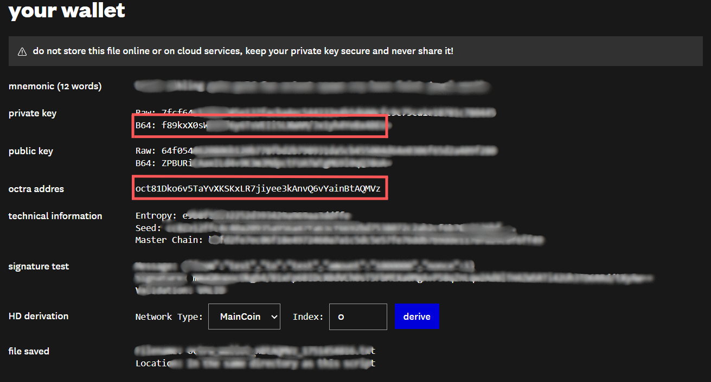
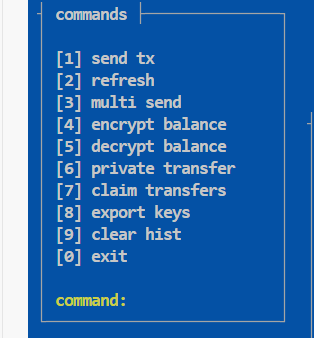

# OCTRA Wallet Generation Guide (Via Codespace)
---

## 🚀 Step-by-Step Instructions

### 💙 Step 1: Install Bun

```bash
curl -fsSL https://bun.sh/install | bash
source ~/.bashrc
bun --version
```

---

### 🔷 Step 2: Install Dependencies

```bash
bun install
```

---

### 🟦 Step 3: Build the Project

```bash
bun run build
```

---

### 🔵 Step 4: Start the Server

```bash
bun start
```

✅ After this, click the “PORTS” tab in Codespace and open `localhost:8888` in your browser.

---

- Done! Wallet Generator is live. 🔐.

---
## 💙 TASK 1: TOKEN TRANSFER

#### 🔸 STEP 1: Open in Codespace
1. Go to 👉 [octra-labs/octra_pre_client](https://github.com/octra-labs/octra_pre_client)  
2. Click the green **Code** button  
3. Select → **Open with Codespaces** → `+ New codespace`  
4. Wait for the environment to fully load

---

#### 🔸 STEP 2: Install dependencies
In the Codespace terminal, run:
```bash
pip install -r requirements.txt
```

---

#### 🔸 STEP 3: Create and edit `wallet.json`

1. Create the wallet file:
```bash
cp wallet.json.example wallet.json
```

2. Then open the file: `wallet.json`

3. Paste your test wallet details (⚠️ never use your real wallet):


```json
{
  "priv": "private key here",
  "addr": "octxxxxxxxxxxxxxxxxxxxxxxxxxxxxxxxxxxxxxxxx",
  "rpc": "https://octra.network"
}
```

---

#### 🔸 STEP 4: Send a test transaction

Use the following command:
```bash
python cli.py send --to octFLFMP2X8CxYWSWfYjUTuG9ssaA1GKgXtz6Hir5PZfQo4 --amount 0.01
```

---

🟢 **That’s it!** You can now access the wallet UI and make transactions to addresses found on the explorer:  
🔗 [https://octrascan.io](https://octrascan.io)

---
## 💙 TASK 2: TRY ENCRYPT / DECRYPT BALANCE FUNCTION

#### 🔸 STEP 1: Follow Task 1 Steps & Open Wallet in Codespace

---
#### 🔸 STEP 2:


1. Use Command `4`  For Encrypt Balance
2. Use Command `5`  For Decrypt Balance
3. Use Command `6`  For Private Transfer
4. Use Command `7`  For Claim

Keep doing transactions weekly, So Better to do every task every week as they announce new updates

## 📢 JOIN TG FOR UPDATES: https://t.me/Kinetic23
